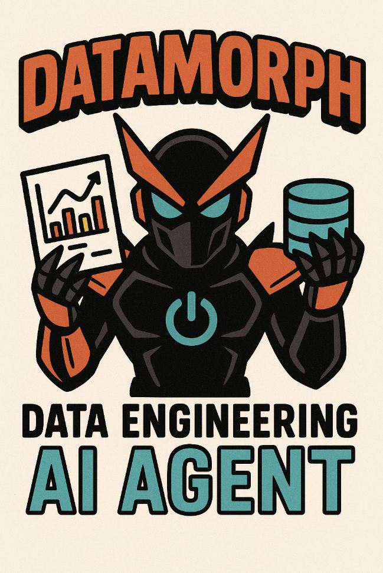
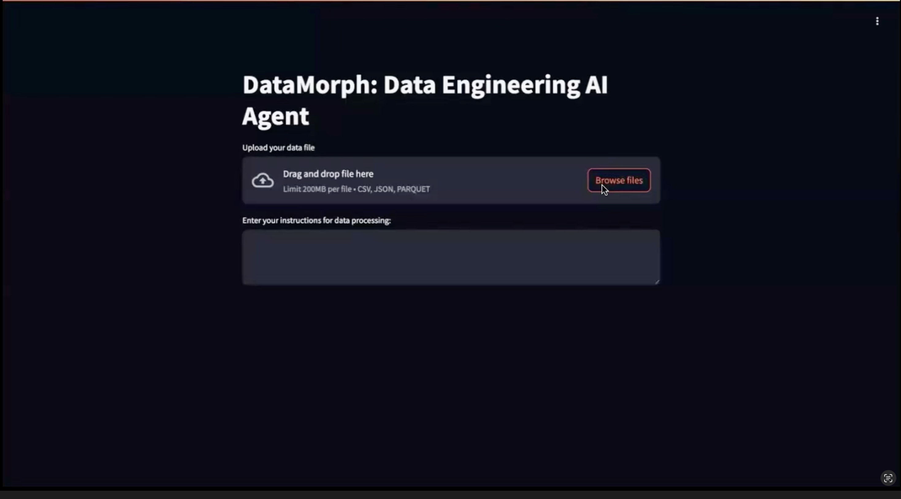
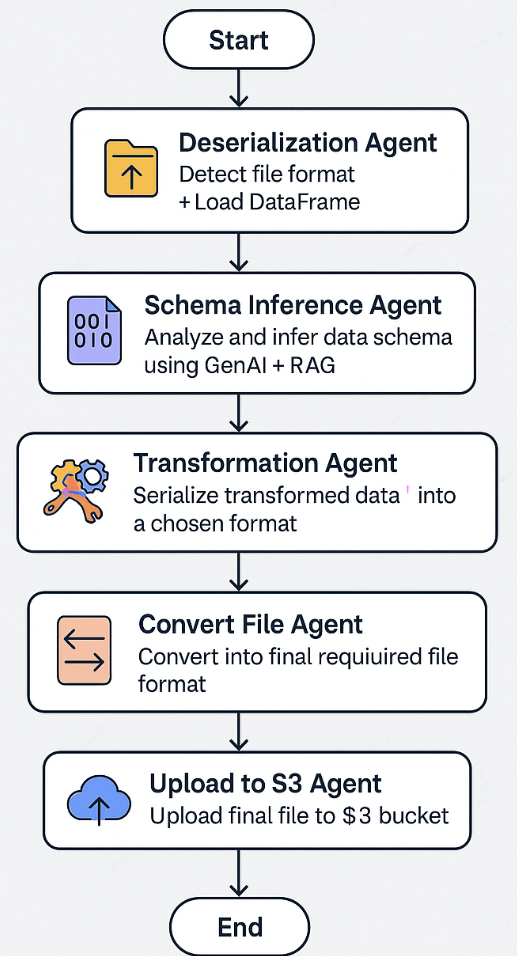

## DataMorph: GenAI-Powered Data Engineering System

### Introduction

**DataMorph** is a modular, GenAI-driven ETL (Extract, Transform, Load) pipeline designed to automate data preparation workflows using Large Language Models (LLMs) and Retrieval-Augmented Generation (RAG). The system is powered by six LangGraph agents that detect, transform, serialize, and upload data with minimal human intervention.



The Streamlit-based web application enables users to upload datasets in any format (CSV, JSON, XML, Parquet, Excel), provide transformation instructions in natural language, and retrieve clean, structured outputs. With built-in support for AWS S3 and an intelligent prompt-generation backend, DataMorph simplifies the complexities of modern data engineering.

---

### Features

- Supports dynamic schema inference and transformation
- Modular agent-based architecture using LangGraph
- LLM and RAG integration for intelligent code generation
- User-friendly Streamlit web interface
- AWS S3 upload integration for cloud storage

---

### Installation

1. Clone this repository.
2. Create a virtual environment:
```bash
python -m venv agent-env
source agent-env/bin/activate  # or use `agent-env\Scripts\activate` on Windows
```
3. Install the required packages:
```bash
pip install -r requirements.txt
```
4. Create an S3 bucket named `eng-agent-bucket` with two prefixes: `Raw` and `Transformed`.

---

### Running the Application

#### Step 1: Launch Streamlit App
```bash
streamlit run main.py
```

#### Step 2: Expose App via LocalTunnel (optional for public preview)
```bash
npm install -g localtunnel
password=$(curl https://loca.lt/mytunnelpassword)
echo $password
lt --port 8501
```
> Enter the password in the terminal to view the Streamlit application at the localtunnel URL.

#### Step 3: Interact with the UI
- Upload a file of any supported format
- Enter your transformation instruction (e.g., "remove rows with missing values")
- Click **Run Agent Workflow** to execute and view intermediate and final results

---

### Example Workflow
1. Upload a `.json` file with nested records.
2. Enter: `Flatten nested objects and remove null values`.
3. Watch as the system infers schema, transforms data, and uploads the final `.csv` to S3.

---

### Demo

Watch our working demo here:

]

> 🎥 Click the thumbnail above or [watch the demo directly on YouTube](https://youtu.be/nRUqC8aI3KY)

---

### Architecture

Below is the high-level architecture of DataMorph:



- Each ETL stage is handled by a dedicated LangGraph agent.
- RAG enriches prompts with domain-specific best practices.
- State is shared across agents to maintain context.

---

### Limitations

- Single-file processing only (multi-file merging under development)
- Limited support for extremely complex/nested XML or JSON
- No fine-tuning (uses zero-shot GPT-4 + prompt engineering)

---

### Contributing

We welcome contributions! Please fork the repo, make your changes, and open a pull request. Follow our coding guidelines and ensure your code passes all tests.


---

### Credits

DataMorph was created by Group 15: Sai Prerana Mandalika, Pranav Patil, Zenan Wang — for DSAN 6725, Spring 2025.

Inspired by LangChain, Streamlit, and modern GenAI architectures.


